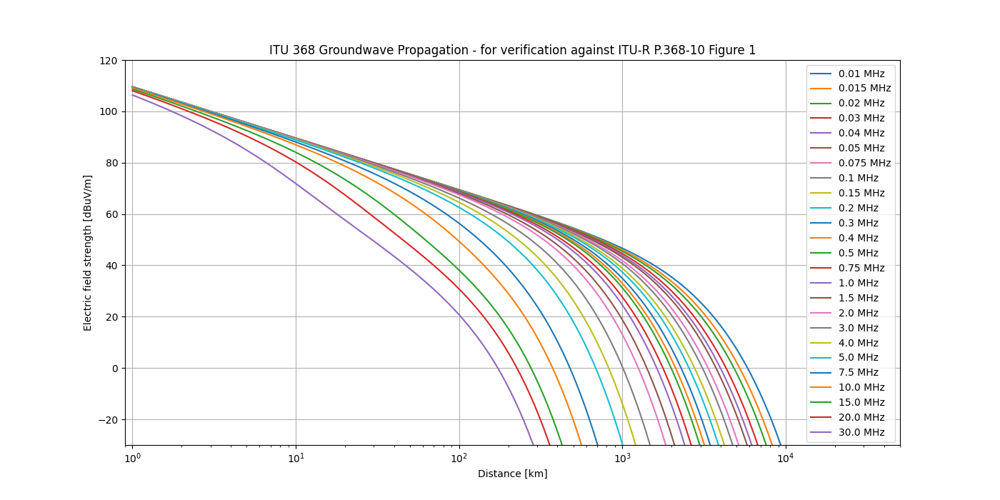

This is a Python wrapper around the LFMF ground wave propagation model C++ code
that can be found in the attachment of ITU-R Recommendation P.368-10 (08/2022).

This code requires a prebuilt dynamic-link library LFMF.dll (Windows) or 
LFMF.so (Linux/Mac) that contains the C++ functions. To do this download the 
source code from the ITU website, where Rec P.368 can be found. On windows the 
easiest solution is to open "/LFMF Source/win32/LFMF.sln" using Visual Studio 
and building the project. This will generate "/LFMF Source/bin/LFMF.dll". 

The original ITU-R P.368-13 source code is made on windows and can be compiled 
to a .dll file. For POSIX systems, change the dll specific code in the header 
file (LFMF.h) before compilation to an .so file. 

